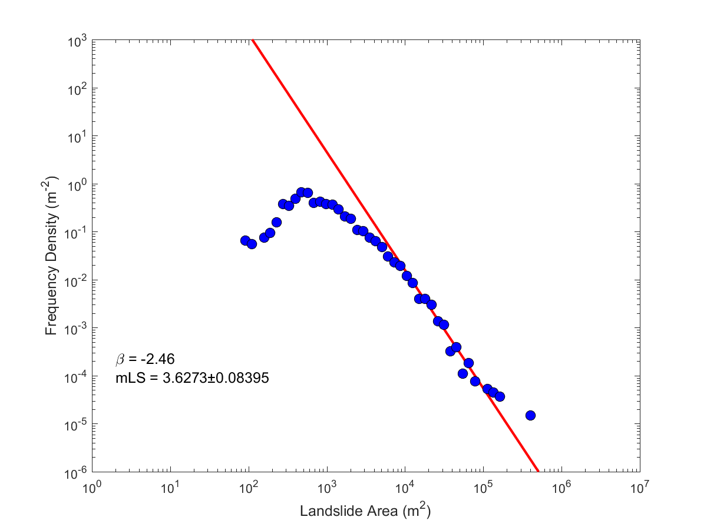

# mLS

## Introduction

mLS is a function that estimates the landslide magnitude (mLS) from an array of areas derived from a landslide inventory
following the methods of Tanyas and others (in prep). The function plots the best power-law fit for the medium
and large landslides and the frequency-area distribution of the analyzed inventory. It also returns the corresponding
cutoff (smallest area that follows power law), beta (power-law exponent), and mLS (landslide magnitude) values.


*Disclaimer:* This software is preliminary or provisional and is subject to 
revision. It is being provided to meet the need for timely best science. The 
software has not received final approval by the U.S. Geological Survey (USGS).
No warranty, expressed or implied, is made by the USGS or the U.S. Government as
to the functionality of the software and related material nor shall the fact of
release constitute any such warranty. The software is provided on the condition
that neither the USGS nor the U.S. Government shall be held liable for any
damages resulting from the authorized or unauthorized use of the software. 


## Installation and Dependencies

### To install this function:

Download mLS.m and add it to your matlab path


### This package also requires the following packages: 

#### plfit

mLS uses the plfit function of Clauset et al.(2009) to determine both the power-law exponent (beta)
and the cutoff value of the power-law. The plfit function can be downloaded from the following link: 
[http://www.santafe.edu/~aaronc/powerlaws/](http://www.santafe.edu/~aaronc/powerlaws/)

Add the plfit function to your path

#### EzyFit

mLS also uses a curve fitting toolbox, EzyFit. The 
referred toolbox needs to be downloaded from the following link: 
[http://www.fast.u-psud.fr/ezyfit/](http://www.fast.u-psud.fr/ezyfit/) and follow the given steps to intall
the toolbox (the explanation given below was taken from the cited website):
   1. Download and unzip the EzyFit Toolbox in a directory somewhere in your system. For instance, in a Windows installation, the directory Documents/MATLAB/ezyfit may be a good location. Do NOT install the toolbox in the Matlab directory itself (Program Files/Matlab directory in Windows). 
   2. Select 'Set Path' (available in the menu File in Matlab 7, or in the tab Home in Matlab 8). In the dialog box, click on 'Add Folder' (NOT 'with subfolders') and select the ezyfit directory. Click on 'Save' and 'Close'.


## Usage example (from mLS.m)

```
% Upload the landslide areas, which you want to analyze their frequency-area 
% distribution, as a horizontal array. In this example, we use the sample_data.m
% file that you can find in the repository. When you open the sample_data.m
% file in the Matlab, you will see the landslide areas array with a parameter name
% of 'Area'. This is the only input we need to run this code.

% In the following lines, the bins are defined with an array. We took 2 as 
% the minimum bin size and we used increasing bin sizes. We increase the 
% bin widths while the landslide size increases, so that bin widths become
% approximately equal in logarithmic coordinates.
x1(1,1)=2;
for i=2:120
    x1(1,i)=x1(1,i-1)*1.2;
end
x2=log10(x1);

Freq=histc(Area,x1); %Frequency values are calculated for each bin 
s=size(x1);
s=s(1,2);
int=zeros(1,s);

for i=2:s
     int(1,i)=x1(1,i)-x1(1,i-1);
end
int(1,1)=min(x1);
FD=Freq./int;

[beta, cutoff]= plfit(Area); % beta and cutoff values are calculated 
beta=-1*beta;

tmpm1 = abs(x1-cutoff); % the index values for the mid-point is calculated for the inventory  
[idxm1 idxm1] = min(tmpm1);

for i=120:-1:1
    if Freq(1,i)>2
        idxm2=i;
        break;
    end
end

x=x1(idxm1:idxm2);
y=FD(idxm1:idxm2);

loglog(x,y,'o');

lastfit=showfit(['a*x^(',num2str(beta),')']); % The c constant is read by using ezyfit toolbox
constant=lastfit.m; hold on
fit_y=constant*x1.^beta;

idxm=(idxm1+idxm2)/2; % The x and y values at mid-point location is read
idxm=round(idxm);
midx=x1(1,idxm);
midy=constant*midx^beta;

Nmidx=27268.11605; % The c' constant is calculated here for by taking the mid-point of Northridge inventory as a reference point
Nmidy=0.004065932702716;
a2=Nmidy/(10000*Nmidx^-2.5); % mLS is taken as 4 for the Northridge inventory
as=Nmidy/(10000*Nmidx^beta);

mLS=log10((midy/(as*midx^(beta)))); % mLS is calculated in this line

% Plot both frequency-area distribution of the given data and the provided power-law fit
loglog(x1,fit_y,'-','LineWidth',2,'Color','r');hold on
loglog(x1,FD,'ok')
axis([1 1.E+7 1.E-6 1000])
set(get(gca,'Xlabel'),'string','Landslide Area (m^2)','FontSize',12, 'FontUnits','points','FontWeight','normal')
set(get(gca,'Ylabel'),'string','Frequency Density (m^-^2)','FontSize',12, 'FontUnits','points','FontWeight','normal')
text(midx*2,midy*2,['\beta = ',num2str(beta),' and mLS = ',num2str(mLS)],'FontSize',10);
end

% For the given sample data, the corresponding cutoff (smallest area that follows power law), 
% beta (power-law exponent), and mLS (landslide magnitude) values should be appeared as 
% 9234, -2.46, and 3.4988 respectively. A plot showing the frequency-area distribution of the given landslides and
% the corresponding power-law fit is also output, see image below.
```


Format: 
